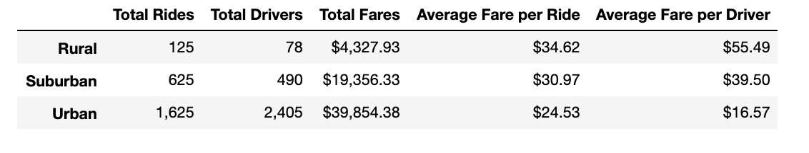
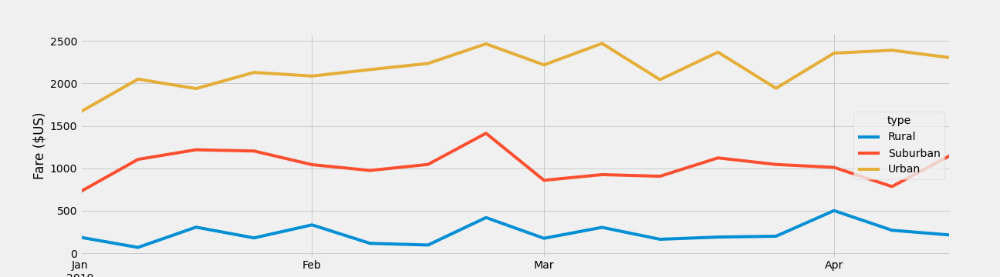

# PyBer_Analysis
Python - matplotlib

## Overview of PyBer Analysis

### Background
The PyBer dataset includes information on ride-shares in different types of cities: Rural, Urban, and Suburban. The data set is complied of two csv files, the city data and the ride data. These files are combined into a single data frame to compare the weekly total for each city type. Using matplotlib and pandas, two embded python libraries, a line graph is produced to show how the data differs based on city type in terms of prices per ride and prices per driver depending on what city type that particular data is found.  

### Purpose
The purpose of this analysis is to create a ride sharing summary as well as a line graph for PyBer ride sharing company to futher their success in different types of cities. Using pandas and matplotlib, two python libraries, analyzing the PyBer data will give insight into the descrepencies between the different city types and the number of drivers, number of riders, and the fares charged in different locations. Calculating the number of drivers and riders in the cities based on type can aid to gaging an appropriate price to charge based on the usage of the PyBer ride shares as well as the importance of having PyBer available in different locations. This gives inforamtion to the PyBer company to showcase the relation between the type of city and the number of drivers and riders, and the total fares, riders, and driver based on the type of city. This information will be used to determine affordability for underserved neighborhoods.

### Results

#### Pyber Summary
The total riders, drivers, and total fares were found for each city type, as well as the average fare per ride and average fare per driver. 
The Urban cities show to have the highest number of rides and drivers, which correlates with the need for PyBer ride sharing in this specific type of city. The Rural cities, have the lowest nuber of rides and drivers, which correlates with the demand for PyBer ride sharing to be not as vital in this specific type of city. The number of rides in urban cities is 13x the number of rides in rural cities, which implies that the demand in urban cities is much higher. The prices per ride in Urban cities is lower because the demand is higher, so there is a greater influx of rides and drivers creating a higher profit for PyBer being available in urban cities. In suburban cities, the number of rides is 5x greater than the number of rides in rural cities, making the demand in suburban cities higher, and the average prices lower.

#### Total weekly fares for each city type. 
When analyzing the total weekly fares in each city type, it is clear that urban cities bring in the largest sum of money per week due to the higher demand of rides. Following urban cities, the second highest total weekly fare is in suburban cities, which is correlated to the demand being second highest in this specific type of city. The total weekly fares for suburban cities and urban cities are much higher than the total weekly fares in urban cities. 

### Summary
It is seen through the analysis of the PyBer data that urban cities are the most profitable city type to increase activity in due to the total weekly fares that are recieved from urban cities. Increasing the number of drivers in urban cities could result in an increase in number of rides, which would increase the profits for PyBer. The best place for Pyber to earn more money is definitely in urban cities, however, there could be benefit with decreasing the fares per ride and fares per drivers in rural cities to see if it would increase the number of rides resulting in an increase in fares because of more use. Another way PyBer could profit more is to increase the number of drivers in months where there seems to be a higher weekly fare intake because it could mean a spike in demand, meaning adding more drivers could increase the profit. Therefore, the PyBer team should focus on urban cities for the a higher success rate. 
